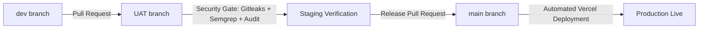
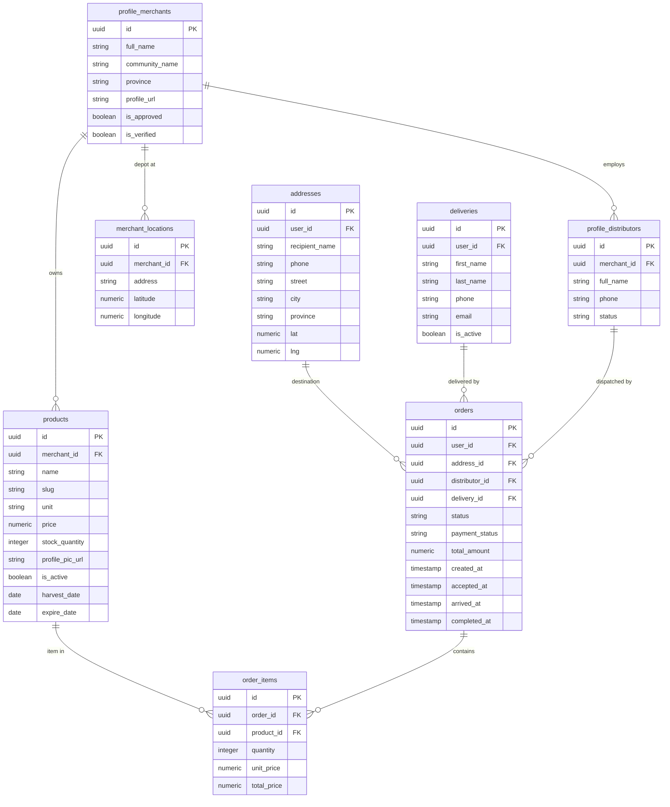

# LocalVegetable Platform (បន្លែស្រុកយើង)

Farm-to-Fork E-Commerce, Multi-Community Distribution, and Last-Mile Logistics Platform.

---

## 1. Project Overview

LocalVegetable is an agricultural supply chain and logistics ecosystem designed to connect rural and peri-urban farm cooperatives in Cambodia directly with urban consumers. The system eliminates intermediaries by allowing verified agricultural communities to list produce, aggregate orders through community-dedicated distributors, and dispatch them to consumers via real-time courier routing.

The platform is architected as a monorepo consisting of four independent web applications:
- Customer Storefront (`/customer`)
- Merchant and Community Distributor Portal (`/merchant`)
- Delivery Courier Logistics PWA (`/delivery`)
- Admin Operations Portal (`/admin`)

---

## 2. Technology Stack and Tools Used

### Core Framework and Runtime
- Next.js 16 (App Router): Server Components, Route Handlers, and client-side streaming.
- React 19: Modern concurrent rendering and hooks.
- Node.js (v20 / v22 LTS): Runtime environment across local development and CI/CD runners.
- TypeScript 5: End-to-end type safety across database schemas, APIs, and UI components.

### Styling and User Interface
- Tailwind CSS v4: Utility-first CSS engine with CSS variables and theme tokens.
- PostCSS: Automated CSS transformation and vendor prefixing.
- Lucide React: Standardized UI symbol library.

### Database, Storage, and Realtime Engine
- Supabase PostgreSQL: Relational database hosting orders, items, products, profiles, addresses, and delivery records.
- Supabase Row-Level Security (RLS): Policy-based data protection enforcing customer, merchant, and courier isolation.
- Supabase Authentication: Passwordless authentication utilizing 8-digit One-Time Passwords (OTP) and email magic links.
- Supabase Realtime: WebSocket-based postgres_changes subscriptions for instant order and inventory synchronization.
- Supabase Storage: Object storage buckets for farm photos, product images, and merchant verification documents.

### Mapping and Geospatial Navigation
- Leaflet and React-Leaflet: Interactive mapping engine embedded in delivery and customer applications.
- OpenStreetMap: Map tile provider for Cambodia.
- OSRM (Open Source Routing Machine): Turn-by-turn road driving directions, live distance calculation (km), and trip duration estimation (minutes) based on actual road networks.

### Payment Integration
- Bakong KHQR: National Bank of Cambodia digital payment standard integrating QR code transactions in Cambodian Riel (KHR).

### Observability and Image Processing
- Sentry (`@sentry/nextjs`): Distributed error monitoring, exception capture, and performance tracing across all portals.
- browser-image-compression: Client-side compression converting uploaded farm produce images to WebP format before storage upload.
- bcryptjs: Cryptographic password hashing for administrative user credentials.

### Security and DevSecOps
- Gitleaks: Automated scanning tool integrated in GitHub Actions to detect hardcoded secrets and leaked tokens.
- Semgrep: Static Application Security Testing (SAST) analyzing code for injection, insecure queries, and anti-patterns.
- NPM Audit: Dependency vulnerability scanning enforcing zero high-severity CVEs.
- Vercel CLI: Production deployment automation.

---

## 3. Git Branching Strategy and Environment Lifecycle

The repository follows a structured branch promotion lifecycle designed to guarantee code quality, automated security checks, and zero-downtime production deployments.



### dev Branch
- Primary integration branch for active development.
- Developers checkout individual feature branches (`feature/delivery`, `feature/merchant-dashboard`) from `dev`.
- Pull requests merged into `dev` are validated for unit integrity and local compilation.
- Used for rapid iteration without triggering production deployments.

### UAT Branch (User Acceptance Testing / Staging)
- Dedicated staging environment for business verification, community testing, and pre-release audits.
- Real community merchants, distributors, and test couriers use this environment to validate real-world workflows.
- Automated Security Pipeline (`.github/workflows/uat.yml`) triggers on every push and pull request targeting `UAT`:
  1. Dependency Audit: Executes `npm audit --audit-level=high` inside `customer`, `merchant`, and `delivery`.
  2. Secret Detection: Executes `gitleaks/gitleaks-action` with deep commit history inspection to prevent credential leaks.
  3. Static Code Analysis: Executes `semgrep/semgrep-action` running security-audit rule sets against all route handlers and client components.

### main Branch (Production)
- Production-ready, stable codebase.
- Only code that has passed all UAT security audits and user acceptance testing is merged into `main`.
- Automated Deployment Pipeline (`.github/workflows/deploy.yml`) triggers on every merge into `main`:
  - Automatically compiles and deploys `customer` and `merchant` to Vercel production endpoints.
  - Deploys with production environment variables and custom domain bindings.

### Isolated Feature and Portal Branches
- `merchant`: Dedicated development stream for merchant features and distributor dispatch.
- `delivery` / `feature/delivery`: Dedicated development stream for courier PWA, GPS tracking, and OSRM navigation.
- `admin` / `admin-frontend-update`: Administrative portal modernization and audit enhancements.

---

## 4. Application Breakdown and Functional Specifications

### 4.1 Customer Storefront (`/customer`)
- Target Audience: Retail consumers purchasing fresh organic produce from local Cambodian farms.
- Default Port: `http://localhost:3000`

#### Core Capabilities
- Community-Driven Produce Catalog: Products display real community origins (e.g., Kandal Community, LocalGrew) with live merchant names and photos.
- Community Filter System: Consumers can filter vegetables by specific agricultural community or browse all local growers.
- Real-Time Cart: Quantities, price calculations, and subtotal summaries formatted in Cambodian Riel (KHR).
- Checkout Flow:
  - Delivery address selection with interactive GPS pin-drop coordinate capture.
  - Delivery instructions and customer contact phone number.
  - Bakong KHQR digital payment generation and verification.
- Passwordless 8-Digit OTP Authentication:
  - Users sign in with their email address.
  - An 8-digit verification code is generated and verified via Supabase Auth OTP verification.
- Order Lifecycle Tracking:
  - Consumers track their order progression in real time: `pending` (placed) -> `accepted` (distributor preparing) -> `out_for_delivery` (courier on road) -> `delivered` (completed).
- Notification Center:
  - Real-time updates on dispatch and delivery status.
  - Unread badge counter decrementing dynamically as messages are inspected.

---

### 4.2 Merchant and Community Distributor Portal (`/merchant`)
- Target Audience: Farm cooperative managers, local growers, and community-assigned distributors.
- Default Port: `http://localhost:3001`

#### Role 1: Grower and Merchant Operations (`/(dashboard)/home`, `/product`, `/order`)
- Real-Time Financial KPI Dashboard:
  - Calculates real metrics directly from database orders for confirmed/delivered items.
  - Dynamic Time Filters: Switch between Day, Week, and Month views.
  - 4 Real KPI Cards: Revenue in KHR, total order count, volume of produce sold (kg/units), and unique customer count.
  - 7-Period Revenue Trend Bar Chart: Dynamic bars representing the last 7 days (with weekday labels), last 7 weeks, or last 7 months, with interactive hover tooltips.
- Produce Catalog and Live Inventory Manager:
  - Add and edit farm crops with title, description, category, unit, harvest date, and expiry date.
  - Inline stock quantity editor for quick daily inventory updates.
  - Client-side WebP image compression before uploading produce pictures to Supabase Storage.
  - Critical Shortage Alerts: Automatically flags products with stock level `<= 10 units` or `0 units` (Out of Stock).
- Customer Order Fulfillment (`/order`):
  - Live order feed displaying customer names, items breakdown, payment status, and order status.
  - Status progression controls: accept order, mark as prepared, or cancel.
  - Realtime WebSockets auto-refreshing the dashboard upon new orders.

#### Role 2: Community Distributor Hub (`/distributors`)
- Target Audience: Distribution workers located at community collection points.
- 8-Digit OTP Distributor Login:
  - Secure login verifying the distributor's email and validating their community link.
- Community Order Isolation:
  - A distributor belonging to Kandal Community can only view and claim orders placed for Kandal Community crops.
  - Prevents cross-community order leakage or accidental dispatch.
- Order Dispatch Workflow:
  - View incoming unclaimed orders for their community.
  - Claim and accept order preparation.
  - Mark order as `out_for_delivery`, releasing it onto the courier dispatch network.
- Real-Time Distributor Notification Bell:
  - Live alerts when new customer orders are placed for their specific community.
  - Dynamic badge showing unread notification count.

---

### 4.3 Delivery Courier Logistics PWA (`/delivery`)
- Target Audience: On-demand delivery couriers and motorcycle delivery riders.
- Default Port: `http://localhost:3002`

#### Core Capabilities
- Courier Onboarding and 8-Digit Activation:
  - Authorized riders activate their account using an 8-digit verification code sent to their registered email.
  - Set and manage their courier password.
- Duty Availability Switch:
  - Live On-Duty / Off-Duty toggle controlling dispatch availability, stored both in localStorage and Supabase `deliveries` table.
- Live Dispatch Claim Board:
  - Displays available orders with status `out_for_delivery` and `delivery_id = null`.
  - Shows estimated driving distance (km), estimated urban transit time (min), and total item units.
  - Atomic order claim preventing duplicate courier assignment.
- Two-Phase Live Road Navigation (Leaflet + OSRM):
  - Phase 1 (Courier to Pickup Depot):
    - Captures courier live GPS position.
    - Resolves real pickup depot coordinates from `distributor_id` -> `profile_distributors` -> `merchant_locations`.
    - Queries OSRM road driving engine to plot actual road route on the map.
  - Arrived at Pickup Milestone:
    - Courier taps "Arrived at Pickup" upon reaching the farm depot.
    - System transitions to Phase 2 automatically, zooming to fit the new destination.
  - Phase 2 (Pickup Depot to Consumer):
    - Plots driving navigation route from depot to customer shipping address.
    - Recalculates route continuously as courier moves.
- Order Details Verification:
  - Displays full items breakdown (crop name, quantity, unit, and produce photo).
  - One-tap customer call action via phone link.
  - Delivery note inspection.
  - One-tap "Mark Delivered" action updating database status to `delivered` with timestamps.
- Administrative Service-Role Backend API (`/api/delivery/orders`):
  - Bypasses Supabase Row-Level Security limitations where unassigned orders cannot be read by couriers via anon client.
  - Enriches payload with customer identities, complete item units, and resolved depot coordinates.

---

### 4.4 Admin Operations Portal (`/admin`)
- Target Audience: System administrators, cooperative auditors, and platform operators.
- Default Port: `http://localhost:3003`

#### Core Capabilities
- Merchant Onboarding and Verification:
  - Audit grower identity, agricultural registration, community name, and farm location.
  - Approve or suspend merchant listings.
- Community Distributor Management:
  - Assign distributors to specific merchant communities.
  - Verify distributor status and credentials.
- Platform Auditing and Ledger:
  - System-wide transaction logs across all communities.
  - Monitoring order volume, delivery completion rates, and platform metrics.
- Administrative User Management:
  - Bcrypt-hashed credentials and role-based access control.

---

## 5. Database Architecture and Entity Relationships

The platform runs on Supabase PostgreSQL with strict foreign keys, timestamps, and indexing.



---

## 6. Monorepo Directory Structure

```
LoalVegatable/
├── .github/
│   └── workflows/
│       ├── deploy.yml            # Vercel production deployment pipeline (main)
│       └── uat.yml               # Security scanning pipeline: audit, Gitleaks, Semgrep (UAT)
│
├── admin/                        # Admin Operations Portal (Port 3003)
│   ├── app/                      # Next.js App Router (Dashboard, Merchants, Distributors)
│   │   ├── (dashboard)/          # Administrative management views
│   │   ├── api/                  # Admin server route handlers
│   │   └── auth/                 # Admin login
│   ├── components/               # Tables, modal views, status indicators
│   └── package.json
│
├── customer/                     # Consumer Storefront (Port 3000)
│   ├── app/                      # Next.js App Router
│   │   ├── auth/                 # 8-digit OTP & Magic Link login
│   │   ├── shop/                 # Product catalog & community farm filters
│   │   ├── cart/                 # Shopping cart & checkout
│   │   ├── notifications/        # Real-time order status updates
│   │   └── api/                  # Customer order creation & notification APIs
│   ├── components/               # Navbar, KHQR modal, product cards
│   └── package.json
│
├── delivery/                     # Delivery Courier PWA (Port 3002)
│   ├── app/                      # Next.js App Router
│   │   ├── (portal)/
│   │   │   ├── current/          # Two-phase OSRM driving navigation
│   │   │   ├── history/          # Completed delivery audit records
│   │   │   └── request/[id]/     # Dispatch details & claim view
│   │   ├── activate/             # Courier 8-digit activation screen
│   │   ├── verify/               # OTP verification
│   │   └── api/delivery/orders/  # Secure administrative order API
│   ├── components/
│   │   ├── delivery/             # Delivery details, order summaries, request cards
│   │   ├── map/                  # Leaflet map & OSRM driving engine
│   │   └── layout/               # Courier shell & notification panel
│   ├── context/                  # DeliveryProvider state & realtime sync
│   ├── lib/
│   │   ├── delivery-service.ts   # Core courier logistics service
│   │   └── supabaseAdmin.ts      # Server-only service role client
│   └── package.json
│
├── merchant/                     # Merchant & Distributor Hub (Port 3001)
│   ├── app/                      # Next.js App Router
│   │   ├── (dashboard)/
│   │   │   ├── home/             # Real-time calculated KPI financial dashboard
│   │   │   ├── order/            # Live order fulfillment console
│   │   │   ├── product/          # Crop inventory & unit editor
│   │   │   └── profile/          # Farm profile & community setup
│   │   ├── distributors/         # Community-isolated distributor dispatch hub
│   │   ├── auth/                 # Merchant & distributor OTP login
│   │   └── api/                  # Merchant analytics & distributor order APIs
│   ├── components/               # Live inventory, alerts, notification bell
│   ├── lib/                      # Supabase client & dashboard context
│   └── package.json
│
└── README.md                     # Platform documentation
```

---

## 7. Local Development Setup

### Prerequisites
- Node.js version 20.x or 22.x
- npm version 10.x or higher
- Supabase Project with PostgreSQL database and Authentication enabled

### Environment Variables Configuration

Create a `.env.local` or `.env` file in each application directory:

#### Customer App (`customer/.env`)
```ini
NEXT_PUBLIC_SUPABASE_URL=https://<your-project>.supabase.co
NEXT_PUBLIC_SUPABASE_ANON_KEY=<your-anon-key>
NEXT_PUBLIC_SENTRY_DSN=https://<dsn>@ingest.sentry.io/<id>
```

#### Merchant Portal (`merchant/.env`)
```ini
NEXT_PUBLIC_SUPABASE_URL=https://<your-project>.supabase.co
NEXT_PUBLIC_SUPABASE_ANON_KEY=<your-anon-key>
SUPABASE_SERVICE_ROLE_KEY=<your-service-role-key>
NEXT_PUBLIC_SENTRY_DSN=https://<dsn>@ingest.sentry.io/<id>
```

#### Delivery Courier PWA (`delivery/.env`)
```ini
NEXT_PUBLIC_SUPABASE_URL=https://<your-project>.supabase.co
NEXT_PUBLIC_SUPABASE_ANON_KEY=<your-anon-key>
SUPABASE_SERVICE_ROLE_KEY=<your-service-role-key>
NEXT_PUBLIC_CUSTOMER_APP_URL=http://localhost:3000
NEXT_PUBLIC_VAPID_PUBLIC_KEY=<your-vapid-key>
NEXT_PUBLIC_SENTRY_DSN=https://<dsn>@ingest.sentry.io/<id>
```

#### Admin Operations (`admin/.env`)
```ini
NEXT_PUBLIC_SUPABASE_URL=https://<your-project>.supabase.co
NEXT_PUBLIC_SUPABASE_ANON_KEY=<your-anon-key>
SUPABASE_SERVICE_ROLE_KEY=<your-service-role-key>
```

### Running All Portals Locally

Execute the following commands in separate terminal sessions:

```bash
# Terminal 1: Customer Storefront (Port 3000)
cd customer
npm install
npm run dev

# Terminal 2: Merchant & Distributor Hub (Port 3001)
cd merchant
npm install
npm run dev -- -p 3001

# Terminal 3: Delivery Courier PWA (Port 3002)
cd delivery
npm install
npm run dev -- -p 3002

# Terminal 4: Admin Operations Portal (Port 3003)
cd admin
npm install
npm run dev -- -p 3003
```

---

## 8. Automated Quality and Security Verification

Run static analysis and type checks across all modules prior to opening pull requests:

```bash
# Verify Customer App
cd customer && npx tsc --noEmit && npm run lint

# Verify Merchant Portal
cd merchant && npx tsc --noEmit && npm run lint

# Verify Delivery PWA
cd delivery && npx tsc --noEmit && npm run lint

# Verify Admin Operations
cd admin && npx tsc --noEmit && npm run lint
```

---

## 9. CI/CD Pipeline Summary

### Security Scan Workflow (`uat.yml`)
- Trigger: Pull Requests and pushes to `UAT`.
- Actions:
  - Installs dependencies in `customer`, `merchant`, and `delivery`.
  - Runs `npm audit --audit-level=high`.
  - Runs `gitleaks` secret detection.
  - Runs `semgrep` SAST analysis with security-audit rules.

### Production Deployment Workflow (`deploy.yml`)
- Trigger: Pushes and merges to `main`.
- Actions:
  - Authenticates with Vercel using `VERCEL_TOKEN`.
  - Deploys `customer` production bundle.
  - Deploys `merchant` production bundle.

---

## 10. License and Governance

Proprietary software developed for Cambodian agricultural cooperatives and fresh produce logistics. All rights reserved.
